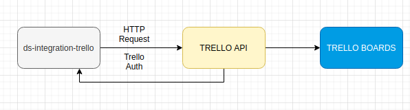

# ds-integration-trello
Project for example(POC) to ingration with Trelo API.

Here, I create a example with my personal Blog Articles Board on Trelo.

There, you can see the sample web page and is it possible give me a recomendad a new article for my blog. ( all articles is write in portugues yet).

<b>Production Example</b>
  <ul>
    <li>https://ds-integration-trello.netlify.app/ <b>Production</b></li>
    <li>https://s3.amazonaws.com/ds-integration-trello/index.html <b>Old</b></li>
  </ul>

# Overview Arquitecture
  
  
  
# Tecnologies
<ul>
  <li>JQuery</li>
  <li>HTML, CSS/ JS</li>
</ul>  

